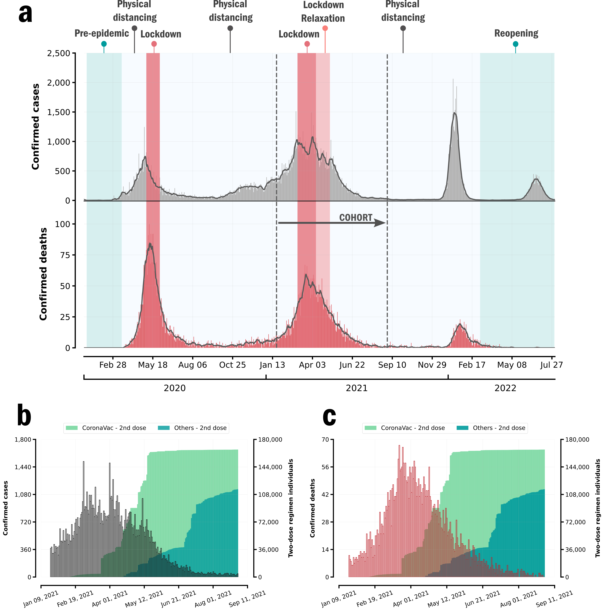

# Impact of CoronaVac on Covid-19 outcomes of elderly adults in a large and socially unequal Brazilian city: A target trial emulation study
 
 
# Introduction
Here we provide the data and pipeline for: [Impact of CoronaVac on Covid-19 outcomes of elderly adults in a large and socially unequal Brazilian city: A target trial emulation study](to-be-released)

### Citation

> Vaccine. DOI: https://doi.org/10.1016/j.vaccine.2023.07.065

# Abstract

Although CoronaVac was the only vaccine adopted for the elderly adults in the first months of the Gamma epidemic wave in Brazil, randomized clinical trials to evaluate its efficacy in the elderly population were limited. In this study, we used routinely collected surveillance and SARS-CoV-2 vaccination and testing data comprising the population of the fifth largest city of Brazil to evaluate the effectiveness of CoronaVac in adults 60+ years old against severe Covid-19-related outcomes. By using the target trial framework, we defined a retrospective cohort including vaccinated individuals who were matched with unvaccinated persons according to socioeconomic covariates. Using the cumulative incidence as the risk associated with each group, starting at day 14 since the receipt of the second dose, we found an 82.3% (95% CI 66.3 - 93.9) effectiveness against Covid-19-related death, 68.4% (95% CI 42.3 - 86.4) against ICU admission, and 55.8% (95% CI 42.7 - 68.3) against hospital admission. Our results show that, despite the critical delay in the delivery of vaccines by the Brazilian government and the limited evidence in efficacy trial estimates, CoronaVac contributed to preventing deaths and severe morbidity due to Covid-19 in elderly adults, the target population at the beginning of the vaccination campaign in Brazil.

__One Sentence Summary:__ Despite the critical delay in the implementation of an immunization program by the federal government, our study suggests that CoronaVac was pivotal in preventing an accentuating dramatic scenario in terms of lives lost to Covid-19.

__Fig. 1 Epidemiology pattern of Covid-19 in Fortaleza, 2020-2022.__
*(a) Epidemiological curves of Covid-19 cases and deaths in Fortaleza, and major interventions implemented in the city, Jan 2020-July 2022. (b) Cases (gray) and (c) deaths (red) of Covid-19 and cumulative distribution of individuals vaccinated with 2 doses (we consider a single dose of the Janssen vaccine as equivalent to a two-dose regimen).* 

# Organization
We have organized this repo into three main folders:
- `code` - Code to perform all the tasks of the project. Codes to bundle all classes to perform a specific tasks.
    - `src` - Main classes to bundle functions regarding a specific task (e. g. performing the matching procedure).
    - `lib` - auxiliary functions used in the main classes.  
- `data` - Contains the final dataset (after linkage) with all deidentified information used to create the cohort and perform the survival analysis.
- `figures` - All figures from the main document for publication. 

# Correspondence
For any issues with anonymization or major issues with the functionality of the script please [create an issue](https://github.com/higorsmonteiro/coronavac-ve-brazil/issues).

## License
The data collected and presented is licensed under the [Creative Commons Attribution 4.0 license](https://creativecommons.org/licenses/by/4.0/), and the underlying code used to format, analyze and display that content is licensed under the [MIT license](http://opensource.org/licenses/mit-license.php). 

# Authors
- __Higor S Monteiro__: Department of Physics, Universidade Federal do Ceará |  : [GitHub Profile](https://github.com/higorsmonteiro)
- __Antonio S Lima Neto__: Secretaria Municipal de Saúde de Fortaleza |  : [Google Scholar](https://scholar.google.com.br/citations?user=ZTQLXYkAAAAJ&hl=pt-BR&oi=ao)
- __Rebecca Kahn__: Department of Epidemiology, Harvard T. H. Chan School of Public Health |  : [Profile](https://ccdd.hsph.harvard.edu/people/rebecca-kahn/)
- __Geziel S Sousa__: Secretaria Municipal de Saúde de Fortaleza |  : [Google Scholar](https://scholar.google.com.br/citations?user=87Rj4lEAAAAJ&hl=pt-BR)
- __Humberto A Carmona__: Department of Physics, Universidade Federal do Ceará |  : [Google Scholar](https://scholar.google.ch/citations?user=58P-HNoAAAAJ&hl=en)
- __José S Andrade, Jr__: Department of Physics, Universidade Federal do Ceará |  : [Google Scholar](https://scholar.google.ch/citations?user=EwWccccAAAAJ&hl=en)
- __Marcia C Castro__: Department of Global Health and Population, Harvard T. H. Chan School of Public Health |  : [Google Scholar](https://scholar.google.com/citations?user=eq9m-DcAAAAJ&hl=pt-BR)
